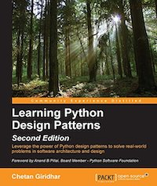

# python-design-patterns
[ <!-- .element height="50%" width="50%" -->](https://www.amazon.com.br/Learning-Python-Design-Patterns-English-ebook/dp/B018XYKNOM/ref=asc_df_B018XYKNOM/?tag=googleshopp00-20&linkCode=df0&hvadid=405268075169&hvpos=&hvnetw=g&hvrand=6610347376625647477&hvpone=&hvptwo=&hvqmt=&hvdev=c&hvdvcmdl=&hvlocint=&hvlocphy=1001763&hvtargid=pla-848237520840&psc=1)

Estudo do Livro "[Learning Python Design Patterns](https://www.amazon.com.br/Learning-Python-Design-Patterns-English-ebook/dp/B018XYKNOM/ref=asc_df_B018XYKNOM/?tag=googleshopp00-20&linkCode=df0&hvadid=405268075169&hvpos=&hvnetw=g&hvrand=6610347376625647477&hvpone=&hvptwo=&hvqmt=&hvdev=c&hvdvcmdl=&hvlocint=&hvlocphy=1001763&hvtargid=pla-848237520840&psc=1)"

# O que são os padrões de projetos?

Os padrões de projetos são soluções para determinados problemas de engenharia de software orientado a objetos que podem ser reutilizáveis independente da linguagem de programação. Inicialmente foram identificados 23 padrões.

## Vantagens em se utilizar
- Reutilizável em vários projetos;
- Problemas em nível de arquitetura podem ser solucionados;
- Resistiram ao teste do tempo e tem sua eficácia comprovada, pois agrega a experiência de desenvolvedores e arquitetos;
- Ganho em confiabilidade;

# Categorias de padrões de Projeto:
- Padrões de criação
- Padrões estruturais
- padrões comportamentais

## Padrões de criação

Os padrões de criação possuem as seguintes propriedades:
- Funcionam com base no modo como os objetos podem ser criados;
- Isolam os detalhes da criação dos objetos;
- O código é independente do tipo do objeto a ser criado;

Um exemplo para o padrão de criação é o *Singleton*.

## Padrões estruturais

Os padrões estruturais possuem as seguintes propriedades:
- Determinam o design da estrutua de objetos e classes para que estes possam ser compostos e resultados mais amplos sejam alcançados;
- Foco em simplificar a estrutura e identificar o relacionamento entre classes e objectos;
- Estão centrados em herança e composição de classes;

Um exemplo para o padrão de criação é o *Adapter*.

## Padrões Comportamentais

Os padrões comportamentais possuem as seguintes propriedades:
- Preocupação com a interação entre os objetos e suas responsabilidades;
- Os objetos devem ser capazes de interagir e, mesmo assim, devem ter baixo acoplamento;

Um exemplo para o padrão de criação é o *Observer*.

Este estudo cobrirá os seguintes padrões:
- [Singleton](singleton/)
- [Factory](factory/)
    - [Simple Factory](factory/#simple-factory)
    - Factory Method
    - Abstract Factory
- Façade
- Proxy
- Observer
- Command
- Template-Method
- MVC
- State
- Antipatterns
